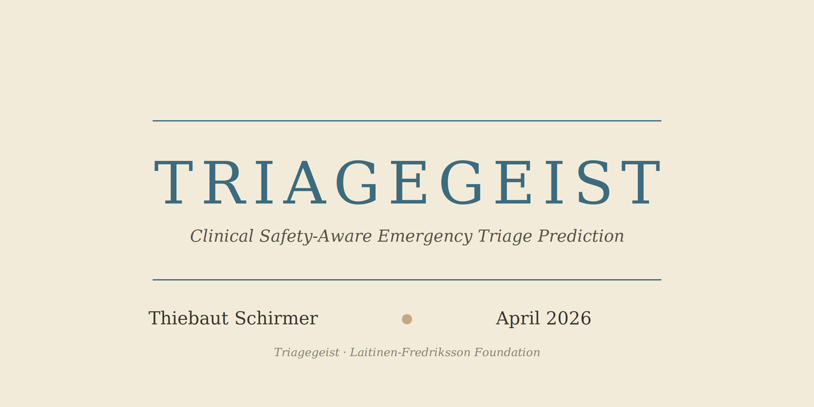

<p align="center">
  
</p>

# Triagegeist: Clinical Safety-Aware Emergency Triage Prediction

A machine learning system for 5-level ESI triage prediction, evaluated
on 418,100 real emergency department visits from MIMIC-IV-ED, with a
clinical-safety framework built around the asymmetric cost of
under-triage and a single-axis fairness audit across age, sex, and race.

Developed as my submission to the [Triagegeist Kaggle
competition](https://www.kaggle.com/competitions/triagegeist) sponsored
by the Laitinen-Fredriksson Foundation.

## Deliverables

This repository contains three complementary pieces of work:

1. **Kaggle notebook**, at
   [`notebook/triagegeist_submission.ipynb`](notebook/triagegeist_submission.ipynb).
   The executable competition submission. Runs end-to-end on a Kaggle
   T4 kernel with internet access enabled, in roughly 35 to 45 minutes.
2. **Competition writeup**, at
   [`writeup/WRITEUP.md`](writeup/WRITEUP.md). The short-form narrative
   submitted as the written component of the competition, under the
   2000-word limit.
3. **Full project report**, at
   [`report/triagegeist_report.pdf`](report/triagegeist_report.pdf). A
   long-form LaTeX document of roughly 125 pages covering the complete
   methodology, all ablations, and chapter-level discussion. This is
   the portfolio-style deliverable rather than a conference paper.

## Key results

### MIMIC-IV-ED (418,100 real ED visits)

| Metric | Value | Context |
| --- | --- | --- |
| Macro F1 | 0.597 | 5-class ESI prediction, 5-fold CV |
| Cohen's quadratic κ | 0.701 | Sits on the live-patient nurse-to-expert reliability reported by Mirhaghi et al. (2015): κ = 0.694 |
| AUROC | 0.911 | Macro-averaged across 5 classes |
| Under-triage rate | 15.22% | At the default argmax operating point, well above the ACS-COT 5% target |

### Kaggle synthetic data (80,000 training visits)

| Pipeline | Macro F1 | Notes |
| --- | --- | --- |
| Text + tabular blend | 0.998 | Recovers the synthetic-label keyword pattern |
| Honest tabular (no text) | 0.873 | No text features; this is closer to what the tabular signal actually supports |

The 12-point gap between these two pipelines on the same data is the
most informative number on the Kaggle split.

## Highlights

- **Synthetic-data leakage discovery.** Severity keywords in the
  Kaggle `chief_complaint_raw` field are near-disjoint across ESI
  levels ("mild" appears in roughly 22% of ESI-4/5 rows and 0% of
  ESI-1/2/3, and so on), and 99.8% of test complaints appear verbatim
  in the training set. Any NLP model on raw text reaches roughly 0.998
  F1 on this data. This motivated the pivot to MIMIC-IV-ED.

- **Real-data evaluation at scale.** One of the few published ML
  evaluations of full 5-class ESI prediction on hundreds of thousands
  of real ED visits. Most published ED triage ML systems predict
  binary outcomes (admission or in-hospital mortality) rather than the
  full ordinal acuity scale.

- **Asymmetric safety framework.** Systematic comparison of
  training-time class weighting against post-hoc threshold shifting,
  both aimed at reducing under-triage. The finding I was most
  surprised by: these two interventions are substitute strategies
  rather than complementary ones. Threshold optimisation targeting
  macro F1 largely undoes the safety benefit of asymmetric training
  when both are applied to the same model.

- **Compensated shock and the age disparity.** An intersectional fairness
  audit found age as the dominant disparity axis: a 1.71x ratio between
  the 18 to 30 band and the 80+ band in under-triage rate. Among truly
  high-acuity patients (ESI-1 or ESI-2), 49.5% of the 18 to 30 group
  present with both heart rate and systolic BP in the normal range, vs
  37.2% of the 66+ group. This is consistent with the clinical
  phenomenon of compensated shock: the model cannot see from vitals
  alone what young cardiovascular systems compensate for.

- **EU AI Act mapping.** Emergency triage AI is classified as high-risk
  under Regulation 2024/1689 Annex III Section 5(d), with compliance
  required from August 2026. The SHAP explainability work, the
  fairness audit, and the asymmetric-threshold operating curve map
  onto Articles 9, 10, 13, and 14 respectively. Chapter 10 of the
  report documents this mapping and the gaps a production deployment
  would still need to close.

## Repository structure

```
kaggle-triagegeist/
├── README.md                         this file
├── LICENSE                           MIT
├── pyproject.toml                    Python package metadata (pip-installable)
├── .gitignore
│
├── notebook/                         Kaggle competition deliverable
│   ├── triagegeist_submission.ipynb  executable notebook submission
│   ├── requirements.txt              Kaggle runtime dependencies
│   └── vangogh_palette.py            colour palette used by the notebook
│
├── writeup/                          Competition writeup
│   ├── WRITEUP.md                    short-form narrative under 2000 words
│   ├── triagegeist_github_banner.png GitHub social preview (1280x640)
│   ├── triagegeist_github_banner.svg editable source for the banner
│   ├── triagegeist_cover.png         Kaggle cover image (560x280)
│   ├── triagegeist_cover.svg         editable source for the cover
│   └── figures/                      8 PNGs referenced by WRITEUP.md
│
├── report/                           Full LaTeX report (~125 pages)
│   ├── README.md                     LaTeX build instructions
│   ├── triagegeist_report.tex        main document
│   ├── triagegeist_report.pdf        compiled report
│   ├── thiebaut-report.sty           custom style (Almond Blossoms palette)
│   ├── references.bib                bibliography
│   ├── chapters/                     chapter files plus appendix
│   └── latex-figures/                figure-generation scripts
│
├── triagegeist/                      Source Python package (pip-installable)
│   ├── __init__.py
│   ├── data_processing.py            feature engineering (Kaggle and MIMIC)
│   ├── clinical_scores.py            NEWS2, qSOFA, REMS, shock indices
│   ├── embedding_extraction.py       Bio_ClinicalBERT and MiniLM
│   ├── model_training.py             5-model blend and stacking
│   ├── threshold_optimization.py     Nelder-Mead and asymmetric sweep
│   ├── bias_audit.py                 single-axis and intersectional fairness
│   ├── shap_analysis.py              TreeSHAP and waterfall attribution
│   └── utils.py                      plotting style and metric helpers
│
├── results/                          Aggregate results only, no patient data
│   ├── kaggle/                       JSON and CSV from synthetic data runs
│   └── mimic/                        JSON and CSV from MIMIC-IV-ED runs
│
├── supplementary_dataset/            Packaged for the Kaggle dataset upload
│   ├── README.md
│   ├── dataset-metadata.json         Kaggle dataset manifest
│   ├── figures/                      pre-rendered PNGs for the notebook
│   └── results/                      aggregate result files
│
├── azure/                            Cloud reproduction on Azure ML
│   ├── AZURE_SETUP.md                workspace provisioning and job submission
│   ├── environment.yml               pinned conda environment
│   └── train_mimic_pipeline.py       end-to-end training script
│
└── data/                             Data placeholder, no data committed
    └── README.md                     Kaggle and MIMIC-IV-ED access guide
```

## Quick start

### Option A: run the notebook on Kaggle

1. Attach the competition data on the Kaggle notebook
   (Settings, Add data, search "triagegeist").
2. Attach the `triagegeist-mimic-supplementary` dataset as well. This
   surfaces the pre-computed MIMIC figures and result tables that the
   notebook references; without it, the MIMIC-section figures will
   fall through to a "[figure unavailable]" placeholder.
3. Set the accelerator to a T4 GPU and enable internet access (the
   notebook downloads Bio_ClinicalBERT from Hugging Face at runtime).
4. Run all cells. The two submission CSVs are written to
   `/kaggle/working/`.

### Option B: install the Python package locally

```bash
git clone https://github.com/Thiebauts/kaggle-triagegeist.git
cd kaggle-triagegeist
pip install -e .
```

Requires Python 3.10 or later. Dependency versions are pinned in
`pyproject.toml`.

### Compile the LaTeX report

```bash
cd report/
latexmk -pdf triagegeist_report.tex
```

Requires a TeX distribution (TeX Live, MiKTeX, or MacTeX) with `biber`
for bibliography processing. The style file uses Palatino, Bera Mono,
and Bera Sans. See `report/README.md` for details.

### Reproduce on MIMIC-IV-ED

The full MIMIC pipeline is not something a reviewer will typically want
to re-run, but if you do:

1. Obtain MIMIC-IV-ED access through
   [PhysioNet](https://physionet.org/content/mimic-iv-ed/). This
   requires CITI human-subjects training and a signed DUA; the
   credentialing process takes roughly one to two weeks in my
   experience.
2. Follow `azure/AZURE_SETUP.md` for end-to-end cloud compute. My run
   cost approximately $22 on Azure ML across CPU and GPU clusters.
3. The `triagegeist/` package modules run the full five-fold benchmark:
   feature engineering, ClinicalBERT fine-tuning, the five-model blend,
   threshold optimisation, bias audit, and SHAP attribution.

## Clinical context

The work addresses the Emergency Severity Index (ESI), the dominant
triage system in North American emergency departments. The report also
discusses connections to RETTS (Rapid Emergency Triage and Treatment
System), used in most Scandinavian EDs, which shares the challenge of
age-unadjusted vital-sign thresholds.

Under-triage, meaning assigning lower acuity than warranted, carries
meaningful mortality risk: odds ratios of 1.24 to 2.18 across published
trauma studies (Haas et al. 2010; Rubano et al. 2016). The American
College of Surgeons Committee on Trauma targets an under-triage rate of
5% or lower while tolerating 25 to 50% over-triage, a 10:1 asymmetry
reflecting the clinical judgement that missing a critical patient is an
order of magnitude more costly than temporarily over-allocating
resources to a stable one.

## Methodology (brief)

- **Text embeddings.** Fine-tuned Bio_ClinicalBERT (Alsentzer et al.
  2019), pretrained on MIMIC-III clinical notes from the same
  institution as MIMIC-IV-ED. 768d outputs reduced to 50 principal
  components per fold.
- **Tabular features.** 65 leakage-safe features covering raw and
  engineered vitals (shock index, MAP, pulse pressure), partial NEWS2
  and qSOFA, age-stratified abnormal-vitals count, cyclical
  arrival-hour encoding, demographics, medication-class flags, and
  prior-visit history with Charlson comorbidity.
- **Models.** A five-model blend (four LightGBM variants plus a
  stacked LightGBM / XGBoost / CatBoost internal ensemble) combined
  through a logistic-regression meta-learner. Blend weights optimised
  with Nelder-Mead on out-of-fold macro F1.
- **Safety interventions.** Asymmetric class weights tested in a
  20-configuration sweep, compared head-to-head with post-hoc per-class
  threshold multipliers optimised by Nelder-Mead. Both approaches are
  characterised on the same Pareto frontier.
- **Fairness.** Single-axis disaggregation across age, sex, and race;
  intersectional analysis is reported but carries an explicit caveat
  because the race-category mapping in MIMIC-IV-ED is incomplete
  (33 source strings collapsed into 5 categories by substring
  matching, with several strings routed to OTHER).
- **Explainability.** TreeSHAP on a 20,000-patient stratified
  subsample, analysed globally, per ESI class, and at the individual
  patient level via waterfall plots.

## Data

No patient-level data is included in this repository. MIMIC-IV-ED
access requires separate PhysioNet credentialing. See
[`data/README.md`](data/README.md) for both the Kaggle data access
process and the MIMIC-IV-ED credentialing workflow. Everything
committed here is either aggregate statistics, model performance
metrics, or tooling code.

## Key references

The complete literature review sits in the LaTeX report
([`report/triagegeist_report.pdf`](report/triagegeist_report.pdf));
representative citations include:

- Mirhaghi et al. (2015). ESI inter-rater reliability meta-analysis.
  *Sultan Qaboos University Medical Journal.*
- Sax et al. (2023). Mistriage in 5.3 million ED encounters. *JAMA
  Network Open.*
- Haas et al. (2010). Under-triage mortality in major trauma.
  *Journal of the American College of Surgeons.*
- Alsentzer et al. (2019). Publicly available clinical BERT embeddings.
  *Clinical NLP Workshop, NAACL.*
- Xie et al. (2022). MIMIC-IV-ED benchmark. *Scientific Data.*
- Widgren and Jourak (2011). Medical Emergency Triage and Treatment
  System (METTS / RETTS). *Journal of Emergency Medicine.*
- Regulation (EU) 2024/1689 (AI Act), Annex III, Section 5(d).

## Limitations, in brief

This is a single-institution retrospective evaluation on MIMIC-IV-ED.
External validation on a second health system, bootstrap confidence
intervals, proper calibration metrics (Brier, ECE, log-loss), SHAP
interaction values, and prospective outcome linkage are all deferred.
The race-category mapping used in the fairness audit is known to be
incomplete. The system is a research demonstration, not a deployable
clinical tool. Chapter 12 of the report lays out the full list of
limitations and the work a production deployment would still need to
do.

## License

MIT License. See [`LICENSE`](LICENSE).
