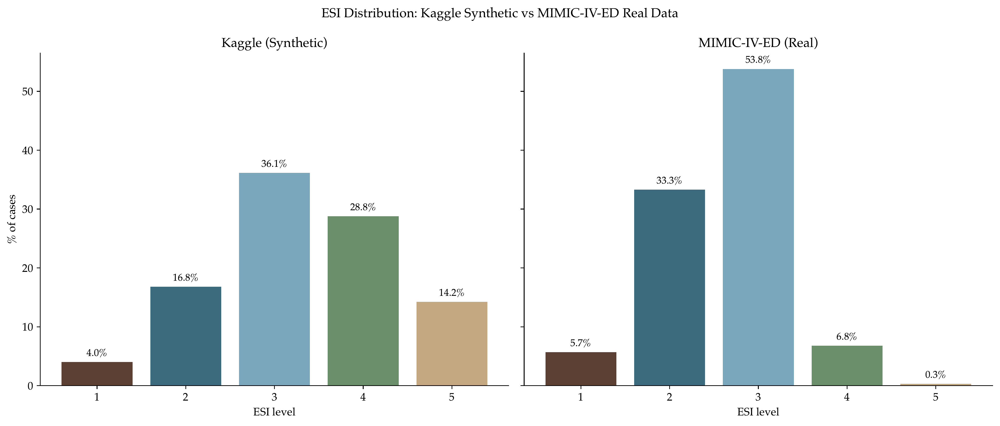
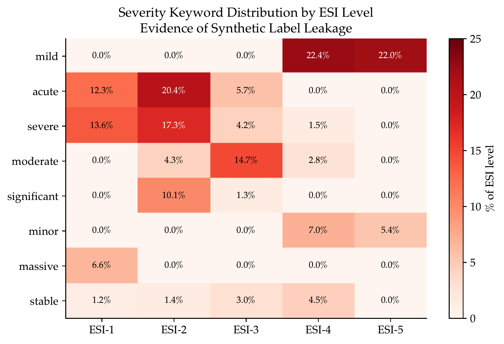
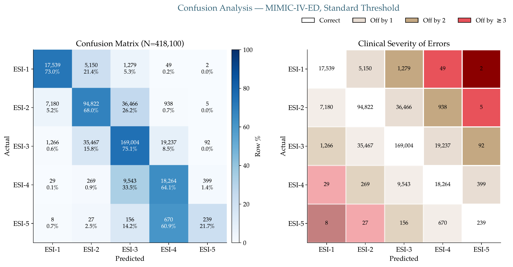
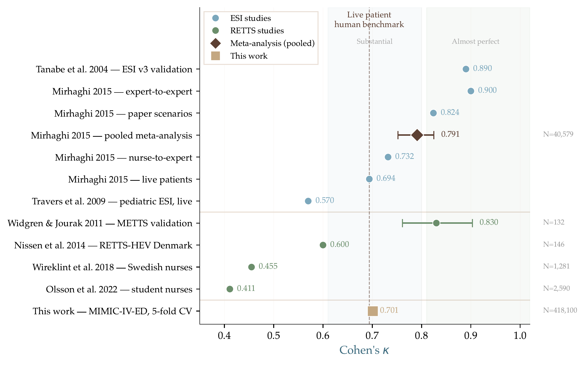
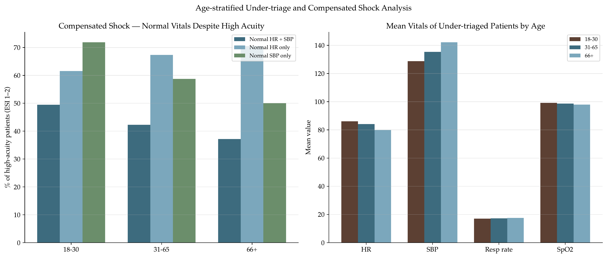
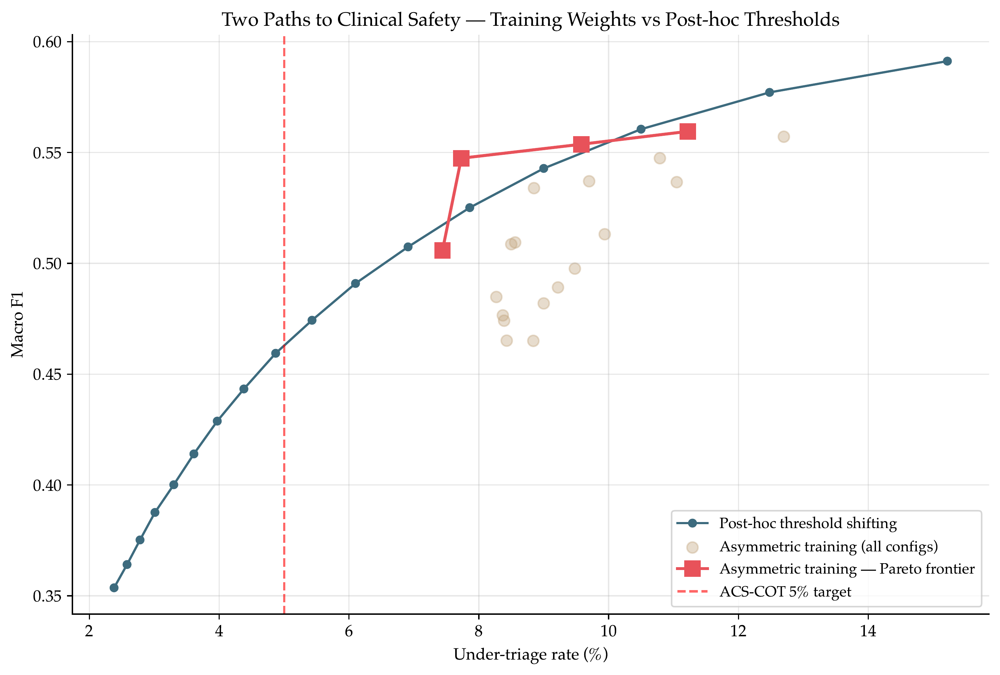
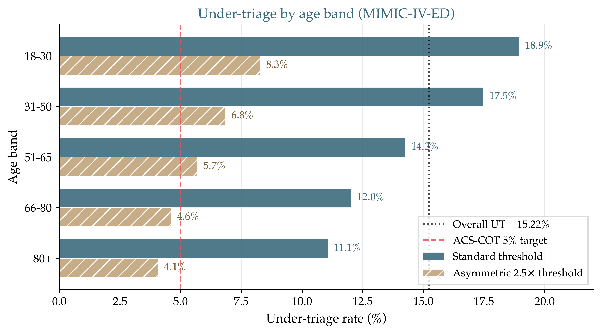
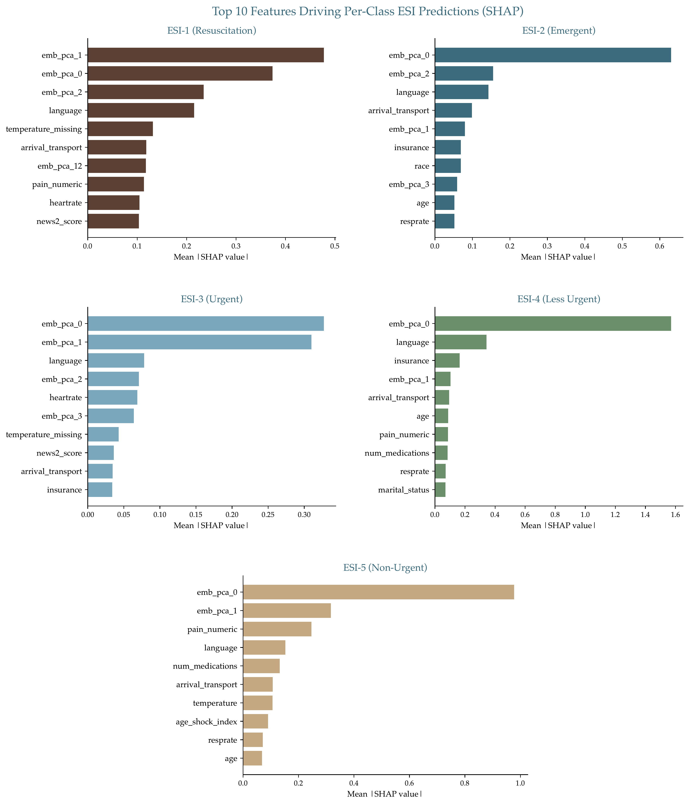

# Triagegeist: Clinical Safety-Aware Triage Prediction with Asymmetric Risk Optimisation

## 1. Clinical problem statement

The Emergency Severity Index (ESI) is the 5-level ordinal triage scale used in most North American EDs, stratifying arrivals from ESI-1 (resuscitation) to ESI-5 (non-urgent). Scandinavian EDs use the Rapid Emergency Triage and Treatment System (RETTS; Widgren & Jourak, *J Emerg Med* 2011), whose two-step algorithm takes the *more urgent* of the vital-sign and chief-complaint assignments, so abnormal vitals always override a benign-sounding complaint. Both share an unsolved problem: age-unadjusted vital thresholds and the **asymmetric harm** of triage errors.

Under-triage, assigning lower acuity than warranted, carries mortality risk: OR 1.24–2.18 for death among under-triaged trauma patients (Haas 2010; Rubano 2016). Sax et al. (*JAMA Netw Open* 2023), auditing 5.3 million Kaiser Permanente encounters, reported ESI sensitivity for critical outcomes of only 65.9%, with **documented subgroup disparities in under-triage risk**. Over-triage costs resources but rarely kills. The American College of Surgeons Committee on Trauma codifies this as **under-triage ≤ 5%, over-triage tolerance 25–50%: a 10:1 asymmetry**.

This asymmetry has regulatory weight. **Regulation (EU) 2024/1689 (the AI Act), Annex III Section 5(d)** classifies AI for "emergency healthcare patient triage" as high-risk; compliance is required from **2 August 2026**. Articles 9 (risk management), 10 (bias), 13 (transparency), and 14 (human oversight) map onto my asymmetric weights, bias audit, SHAP explanations, and per-class operating-point controls.

Most published ML triage systems predict *binary* outcomes (mortality, ICU, hospitalisation) at AUC 0.80–0.94 (Levin 2018; Kwon 2018). Full **5-class ESI prediction is genuinely underexplored**: Ivanov et al. (2021) reported 75.7% accuracy without κ or macro F1; Xie et al. (*Sci Data* 2022) established MIMIC-IV-ED as a benchmark but did not run the 5-class task. This report attempts to fill that gap.

## 2. Data & methodology

**Two datasets, two purposes.** Kaggle competition data (80,000 train + 20,000 test) for submission; MIMIC-IV-ED (Xie 2022; 418,100 real ED visits from Beth Israel Deaconess Medical Center) for honest clinical validation under the PhysioNet Credentialed DUA. No patient-level data is redistributed. The ESI distributions of the two sources differ markedly (figure below).

**Synthetic leakage discovery.** An early audit of the Kaggle `chief_complaint_raw` field revealed a synthetic-generation fingerprint: severity keywords are near-disjoint across acuity levels (heatmap below): "mild" in 22% of ESI-4/5 and 0% of ESI-1/2/3; "severe" and "massive" concentrate in ESI-1/2; "moderate" peaks in ESI-3. Exact-match analysis shows **99.8% of test complaints appear verbatim in training**. Any NLP model on raw text achieves ~0.998 F1; tabular-only models plateau at ~0.873. Two results are therefore reported on the Kaggle data: a headline F1 that recovers the leakage, and an honest F1 that does not.

**Feature engineering.** Both pipelines share a 65-feature tabular core (`triagegeist/data_processing.py`): 6 vitals with missingness flags; derived scores (shock index, pulse pressure, MAP, parsed pain); partial NEWS2 and qSOFA; age-stratified abnormal-vitals count; cyclical arrival-hour; 7 demographic categoricals; 13 medication-class flags from `medrecon`; prior-visit history (visits, admissions, DRG severity/mortality, Charlson comorbidity with original 1987 weights plus 16 individual flags). Cumulative features are **shifted by one visit per subject** as a leakage guard; no post-triage variables are used. With 50 PCA components of ClinicalBERT embeddings, the full input is 115-dimensional.

**Text embeddings.** Bio_ClinicalBERT (Alsentzer 2019), pretrained on MIMIC-III clinical notes from the same institution as MIMIC-IV-ED, was fine-tuned on the ESI objective for 3 epochs (lr = 2e-5, batch 16, max len 128, FP16) on an Azure T4 GPU. Mean-pooled embeddings (768d) were reduced to 50 principal components *per fold*.

**Model architecture.** A 5-model blend trained under 5-fold stratified CV: baseline LightGBM; weighted LightGBM (inverse-frequency, 47.8% of blend); more-trees LightGBM (800 × lr 0.02); early-stopping LightGBM (2000 max); and a stacked internal ensemble (LightGBM + XGBoost + CatBoost combined via a 3-fold-inner logistic meta-learner). Blend weights were optimised via softmax-reparameterised Nelder-Mead on macro F1 over OOF probabilities. Per-class multiplicative threshold shifts (`probs × exp(log_m)`) were applied via Nelder-Mead.

## 3. Key findings

### Performance on MIMIC-IV-ED (418,100 visits, 5-fold CV)

| Variant | Macro F1 | κ | AUROC | Per-class F1 (1/2/3/4/5) |
|---|---|---|---|---|
| Single LightGBM baseline | 0.5562 | 0.684 | 0.912 | 0.70 / 0.68 / 0.79 / 0.44 / 0.16 |
| 5-model convex blend | **0.5912** | **0.702** | 0.911 | 0.70 / 0.69 / 0.77 / 0.54 / 0.26 |
| Blend + Nelder-Mead thresholds | **0.5969** | 0.701 | 0.911 | 0.71 / 0.70 / 0.77 / 0.53 / 0.28 |

Errors concentrate at adjacent acuity levels rather than in catastrophic mis-triage (matrix below).

**Human benchmark.** Mirhaghi et al. (2015) meta-analysed 19 ESI reliability studies across 6 countries (40,579 cases): pooled nurse-to-expert κ = 0.791 on scenarios but only **0.694 on live patients**; paediatric live triage as low as 0.57 (Travers 2009). My κ = 0.701 sits on the live-patient nurse-to-expert baseline, matching realistic human performance on the same task (forest plot below).

### Performance on Kaggle synthetic data (80,000 visits)

| Variant | Macro F1 | Notes |
|---|---|---|
| Honest tabular (no text) | 0.873 | Genuine tabular signal |
| Text + tabular (MiniLM) | 0.9974 | Severity-keyword leakage |
| Text + tabular + thresholds | 0.9975 | Marginal threshold gain |

The 12-point gap between honest and leakage-recovering pipelines is itself the most informative finding on the Kaggle split.

### Compensated shock in young patients

The dominant fairness signal is not race or sex: it is **age**. Among high-acuity MIMIC patients, checking whether heart rate *and* SBP are both within normal limits:

| Age group | n high-acuity | % both HR and SBP normal |
|---|---|---|
| 18–30 | 20,931 | **49.5%** |
| 31–65 | 77,281 | 42.3% |
| 66+ | 65,192 | 37.2% |

Half of young high-acuity patients present with normal vitals: compensated-shock physiology. Under-triage is worst in the subgroup that compensates most: mean predicted acuity for under-triaged 18–30 patients is 3.51 vs a true mean of 2.46, a full level off. The figure below pairs under-triage rate with dual-vital normality across age bands.

### Calibration

Per-class isotonic regression (nested 5-fold on OOF probabilities) marginally improves threshold-optimised macro F1 (0.5969 → 0.5985). The uncalibrated operating curve actually reaches the ACS-COT 5% under-triage target slightly earlier (multiplier 3.0, F1 0.459) than the calibrated one (multiplier 3.25, F1 0.440). Calibration helps only at the threshold-optimised operating point and for honest probability estimates in downstream use.

## 4. Clinical safety framework

**Clinical operating curve.** The honest way to present the safety/accuracy trade-off is a Pareto frontier sweeping asymmetric training weights or post-hoc threshold shifts (`results/mimic/clinical_operating_curve.csv`).

**20-configuration asymmetric weight sweep.** Twenty per-class weighting schemes were evaluated, each a full MIMIC blend retrain. Four Pareto-optimal configurations emerged:

| Config | Weights (1/2/3/4/5) | Macro F1 | UT rate |
|---|---|---|---|
| Heavy3 | 8/5/2/1/1 | 0.5058 | **7.4%** |
| Strong3 | 5/3/1/1/1 | 0.5474 | 7.7% |
| Moderate2 | 3/2/1/1/1 | 0.5537 | 9.6% |
| Mild+ | 2/1.5/1/1/1 | **0.5595** | 11.2% |

No configuration achieves the ACS-COT 5% target without major F1 loss; the honest reality of ordinal medical triage.

**Substitute, not complementary.** Training-time asymmetric weights and post-hoc threshold shifts are substitute strategies. When both are applied, threshold optimisation undoes the safety benefit of the asymmetric weights:

| Variant | Macro F1 | UT rate |
|---|---|---|
| Balanced + thresholds | 0.597 | 14.5% |
| Moderate asymmetric, no thresholds | 0.547 | 7.7% |
| Moderate asymmetric + thresholds | 0.578 | 15.4% |
| Directional penalty, no thresholds | 0.475 | 6.8% |
| Directional penalty + thresholds | 0.558 | 15.5% |

The threshold search has no knowledge of clinical harm asymmetry. **Institutions must pick one safety lever at deployment, not both** (Pareto plot below).

**Single-axis audit.** Disaggregating under-triage by age, sex, and race separately shows age as the dominant disparity axis: 1.71× between the 18–30 band (18.94% UT) and the 80+ band (11.07% UT). Sex disparity is negligible (1.02×). Race disparity is 1.30×, but the race-category mapping used in this audit is incomplete (33 source strings collapsed to 5 categories by substring matching, with several routed to OTHER), so the race-level numbers are flagged as preliminary and not presented as a primary finding. Intersectional sub-analyses are deferred to external validation where race coding can be audited against ground truth. The figure below quantifies the single-axis disparities.

## 5. Explainability

TreeSHAP was computed on a 20,000-patient stratified subsample of the LightGBM blend component. Per-ESI-class attribution is the natural unit for multiclass output.

**Embedding dominance.** The top-attribution feature across most ESI classes is `emb_pca_0` (the first principal component of fine-tuned ClinicalBERT embeddings), beating every vital sign. This reflects a known trade-off with dense text embeddings: they carry signal that keyword features cannot, but do not decompose into named clinical concepts (top-10 attributions per class, below).

**Fairness-relevant attribution.** `language` and `insurance` appear in the top-20 features. Both are proxies for socioeconomic status and access-to-care rather than clinical pathology. A preliminary ablation without these features showed comparable F1 at roughly 0.01 lower macro F1, small enough to flag for Article 10 review before any deployment.

**Waterfall cohorts.** Three archetypes (high-confidence correct, low-confidence correct, severely mis-triaged) make individual decisions legible (Article 13).

### EU AI Act compliance mapping

| Article | Implementation |
|---|---|
| Art. 9: Risk management | Asymmetric weights encode under-triage harm; operating curve lets operators pick a risk-proportionate point |
| Art. 10: Data & bias | Intersectional audit (age × sex × race); Art. 10(5) debiasing invoked |
| Art. 13: Transparency | SHAP global, per-class, and per-patient waterfalls; model card |
| Art. 14: Human oversight | Operating curve gives operators levers; no autonomous action |

## 6. Limitations

- **ESI-5 remains near-unlearnable**: ~1,100 samples, 0.3% prevalence, best F1 = 0.282.
- **No variant meets ACS-COT 5% UT at acceptable F1**: 4.96% UT comes at F1 = 0.44.
- **Asymmetric safety widens the relative age disparity** even as absolute UT falls in every band.
- **Single institution.** External validation (US or Scandinavian RETTS) needed for generalisability.
- **Text embedding dominance** makes top-feature attribution uninterpretable for SHAP consumers.
- **Insurance/language features** need ethics review before deployment.

## 7. Reproducibility

**Full source code and reproduction instructions: <https://github.com/Thiebauts/kaggle-triagegeist>**

The `triagegeist/` Python package is importable with no hard-coded paths. MIMIC-IV-ED is accessed under the PhysioNet DUA and is not redistributed; instructions in `data/README.md`. The full MIMIC pipeline runs end-to-end on Azure ML for roughly $22 (see `azure/AZURE_SETUP.md`). The Kaggle notebook reads pre-computed results from the supplementary dataset and does not require PhysioNet access.

## 8. References

- Alsentzer E, et al. Publicly available clinical BERT embeddings. *Proc 2nd Clinical NLP Workshop, NAACL* 2019:72–78.
- Charlson ME, et al. A new method of classifying prognostic comorbidity. *J Chronic Dis* 1987;40(5):373–383.
- Haas B, et al. Survival of the fittest: hidden cost of under-triage of major trauma. *J Am Coll Surg* 2010;211(6):804–811.
- Ivanov O, et al. KATE: deep-learning-based triage. *J Emerg Nurs* 2021;47(2):265–278.
- Kwon J, et al. Deep-learning-based out-of-hospital cardiac arrest prognostic system. *PLoS ONE* 2018;13(10):e0205836.
- Levin S, et al. Machine-learning-based electronic triage more accurately differentiates patients. *Ann Emerg Med* 2018;71(5):565–574.
- Lundberg SM, Lee SI. A unified approach to interpreting model predictions. *NeurIPS* 2017:4768–4777.
- Mirhaghi A, et al. Reliability of the Emergency Severity Index: meta-analysis. *Sultan Qaboos Univ Med J* 2015;15(1):e71–e77.
- Regulation (EU) 2024/1689 (AI Act), Annex III Section 5(d).
- Royal College of Physicians. *National Early Warning Score 2 (NEWS2)*. London: RCP, 2017.
- Rubano JA, et al. Under-triage in the trauma system. *J Trauma Acute Care Surg* 2016;81(6):1142–1149.
- Sax DR, et al. Evaluation of ESI triage accuracy in large healthcare system. *JAMA Netw Open* 2023;6(3):e233404.
- Travers DA, et al. Reliability of pediatric ESI. *Acad Emerg Med* 2009;16(9):843–849.
- Widgren BR, Jourak M. Medical Emergency Triage and Treatment System (METTS). *J Emerg Med* 2011;40(6):623–628.
- Wuerz RC, et al. Reliability and validity of a new five-level triage instrument. *Acad Emerg Med* 2000;7(3):236–242.
- Xie F, et al. MIMIC-IV-ED: a freely accessible emergency department database. *Sci Data* 2022;9:658.
